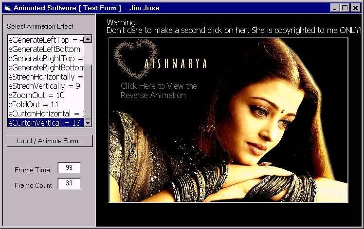



## Animation Mania \[ Outstanding form Animations \]

### Description

Note that ''The First Of It's Kind'' . This is an example of very cool form animations that vb is capable to do. The code is packed in a single Function and there are 13 different Animation-Styles inside. The code gives you a smooth Flash style effects, in which the Frames/Time can be fully customized. The same code can be used to animate Form, PictureBox or any other hwndObject and to develope new effects. Hope you realy enjoy this. Good Luck!   @}-}}-- from 'Jim Jose'
 
### More Info
 

             |
---                |---
**Submitted On**   |2004-01-28 00:39:04
**By**             |[JJJJJJJJ](https://github.com/Planet-Source-Code/PSCIndex/blob/master/ByAuthor/jjjjjjjj.md)
**Level**          |Intermediate
**User Rating**    |4.8 (48 globes from 10 users)
**Compatibility**  |VB 6\.0
**Category**       |[Graphics](https://github.com/Planet-Source-Code/PSCIndex/blob/master/ByCategory/graphics__1-46.md)
**World**          |[Visual Basic](https://github.com/Planet-Source-Code/PSCIndex/blob/master/ByWorld/visual-basic.md)
**Archive File**   |[Animation\_1899286102005\.zip](https://github.com/Planet-Source-Code/jjjjjjjj-animation-mania-outstanding-form-animations__1-61026/archive/master.zip)

